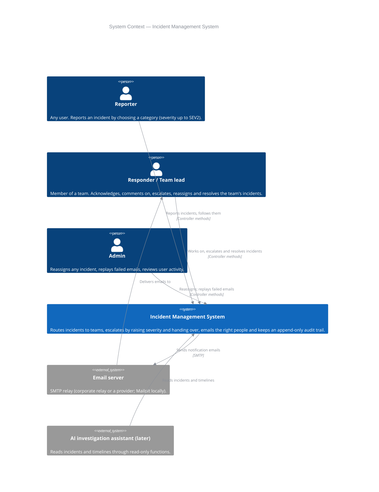
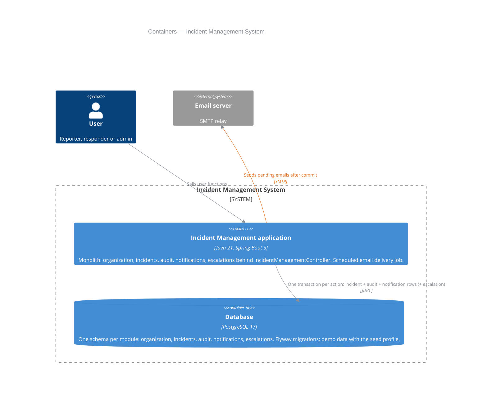
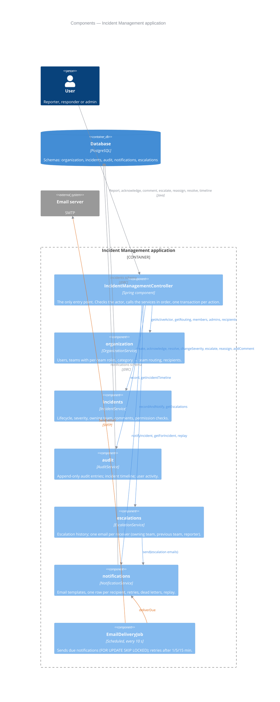
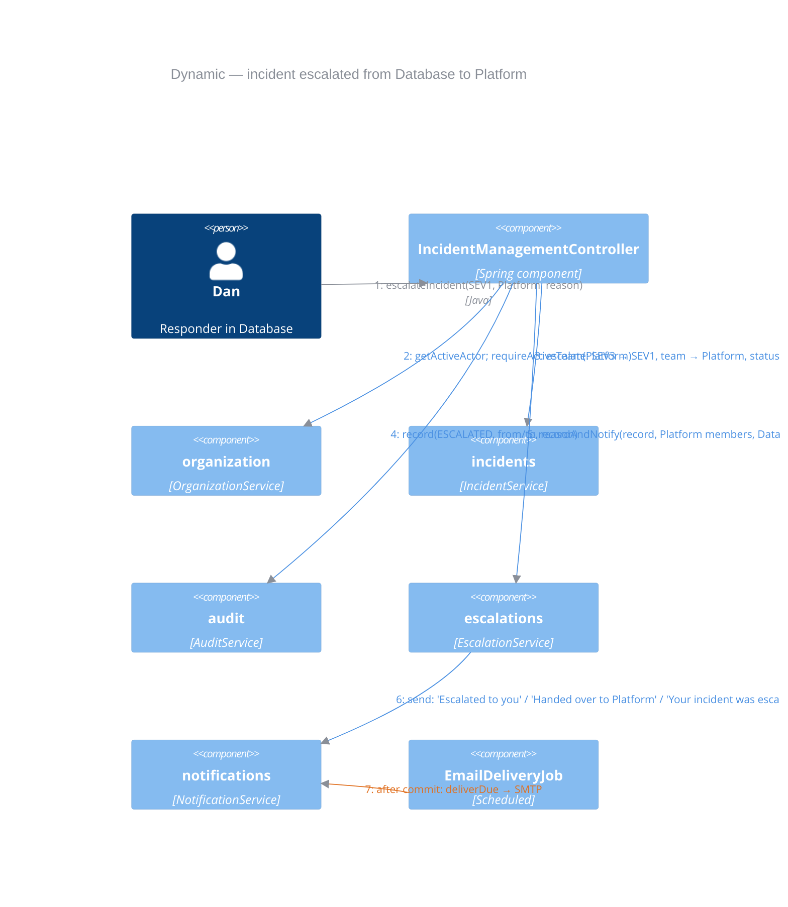

# Incident Management System — C4 Model

**Updated:** 2026-10-02
**Notation:** [C4 model](https://c4model.com/) — Level 1 System Context, Level 2 Containers, Level 3 Components, plus one dynamic view.
**Related:** [product design](product%20design/productDesign.md), [system-design.md](system-design.md), [development-plan.md](development-plan.md).

**Arrow colours:** blue = synchronous call inside the application, orange = after commit (email delivery), grey = user / external interaction.
Colours are mid-tone so they stay readable on both dark (IntelliJ Darcula, GitHub dark) and light backgrounds.

The diagrams show the **implemented** system. Elements marked **(later)** are not built:

| Element | Now | Later |
|---|---|---|
| User access | Java methods on `IncidentManagementController` (no HTTP); caller passes the acting user id | HTTP API / UI, login (OIDC) |
| Notification channel | email over SMTP (Mailpit locally) | Slack, SMS |
| Escalation | manual, by a team member | automatic by team policy |
| AI investigation assistant | — | separate service with read-only access |

---

## Level 1 — System Context
Who uses the system and which external systems it depends on.

---

## Level 2 — Containers
One deployable application (monolith, no web server) and one PostgreSQL database with one schema per module.

---

## Level 3 — Components of the application
Each module is a component with `model/`, `repository/` and `service/` (interface + Impl). Modules don't call each
other; the Controller orchestrates them. The only module-to-module call is escalations → notifications.

Not drawn to keep the diagram readable: organization, audit and escalations also read/write their own schemas.

---

## Dynamic view — manual escalation with hand-over
Dan (Database) escalates a SEV3 incident to SEV1 and hands it over to Platform.

Result: Platform owns the incident at SEV1 and status `OPEN`; Platform members, the remaining Database members and the
reporter each get their own email; the timeline shows the escalation with Dan as the actor and the reason.
