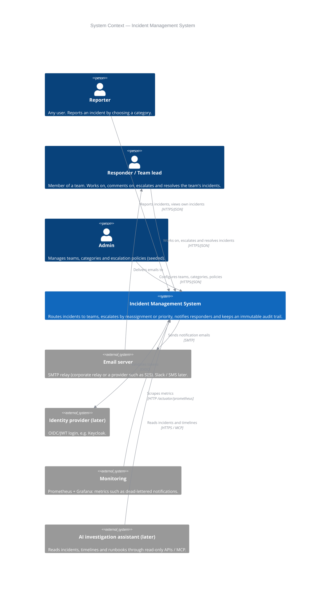
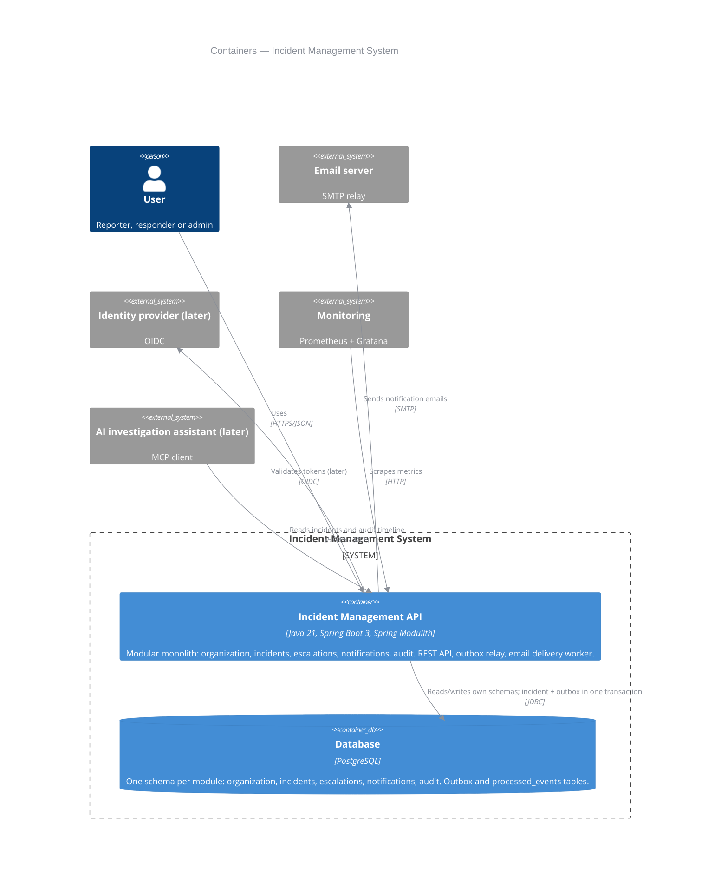
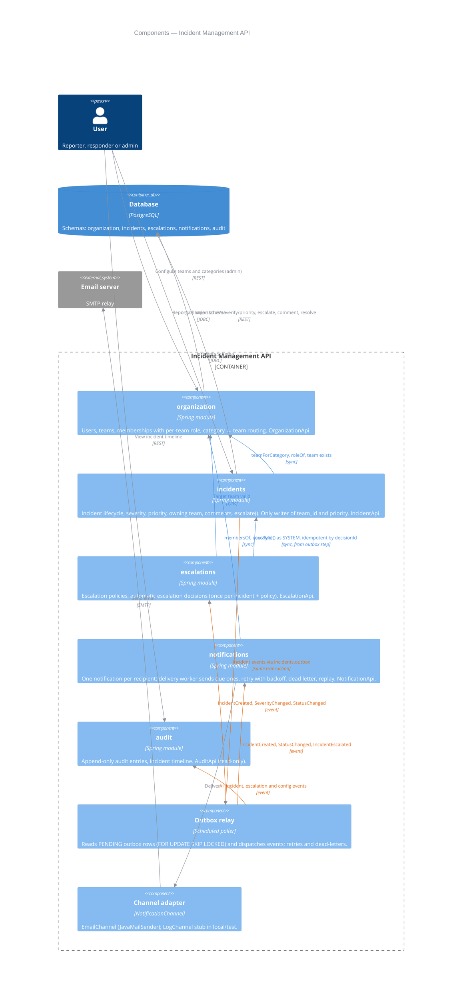
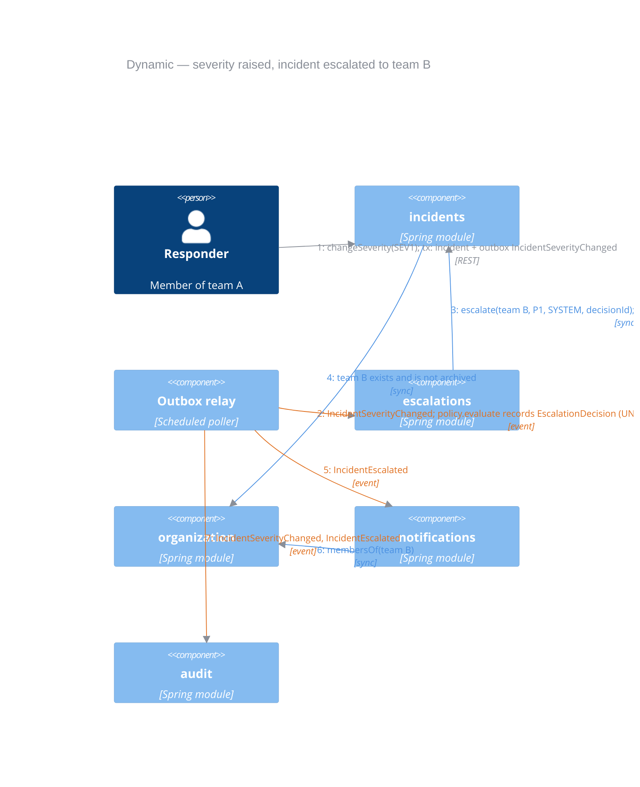

# Incident Management System — C4 Model

**Updated:** 2026-10-01
**Notation:** [C4 model](https://c4model.com/) — Level 1 System Context, Level 2 Containers, Level 3 Components, plus one dynamic view.
**Related:** [product design](product%20design/productDesign.md), [system-design.md](system-design.md), [development-plan.md](development-plan.md).

**Arrow colours:** blue = synchronous call, orange = asynchronous event (outbox), grey = user / external interaction.
Colours are mid-tone so they stay readable on both dark (IntelliJ Darcula, GitHub dark) and light backgrounds.

The diagrams show the **planned** system. Elements marked **(later)** are not part of Impl:

| Element | Impl                                          | Later |
|---|-----------------------------------------------|---|
| Notification channels | email over SMTP; stub that logs in `local`/`test` | Slack, SMS |
| Event transport | outbox relay dispatches in-process | no broker planned |
| Authentication | `X-User-Id` header                 | external identity provider (OIDC/JWT) |
| AI investigation assistant | —                                             | separate service with read-only access |

---

## Level 1 — System Context
Who uses the system and which external systems it depends on.

---

## Level 2 — Containers
One deployable application (modular monolith) and one database with one schema per module. There is no message broker: events go through the outbox in-process, and emails leave through SMTP.

---

## Level 3 — Components of the Incident Management API
Each module is a component with a public `api` package; everything else is internal.
Arrows between modules are either **synchronous** calls to another module's `api` or **asynchronous** events from the publisher's outbox.

Not drawn to keep the diagram readable: `escalations`, `notifications` and `audit` also read/write their own schemas, and every consumer records `processed_events` for idempotency.

---

## Dynamic view — automatic escalation
A responder raises severity SEV2 → SEV1; the team's policy (threshold SEV1, target team B) escalates the incident.

Result: team B owns the incident with priority P1, its members are notified, the status is unchanged, and the
audit timeline shows the severity change and the escalation under one `correlationId`.
