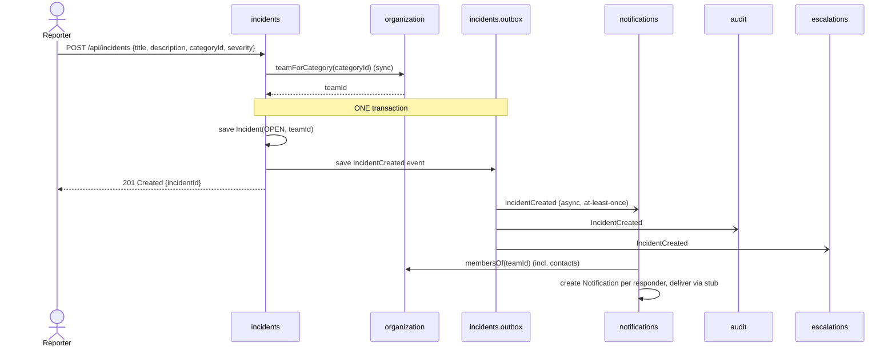
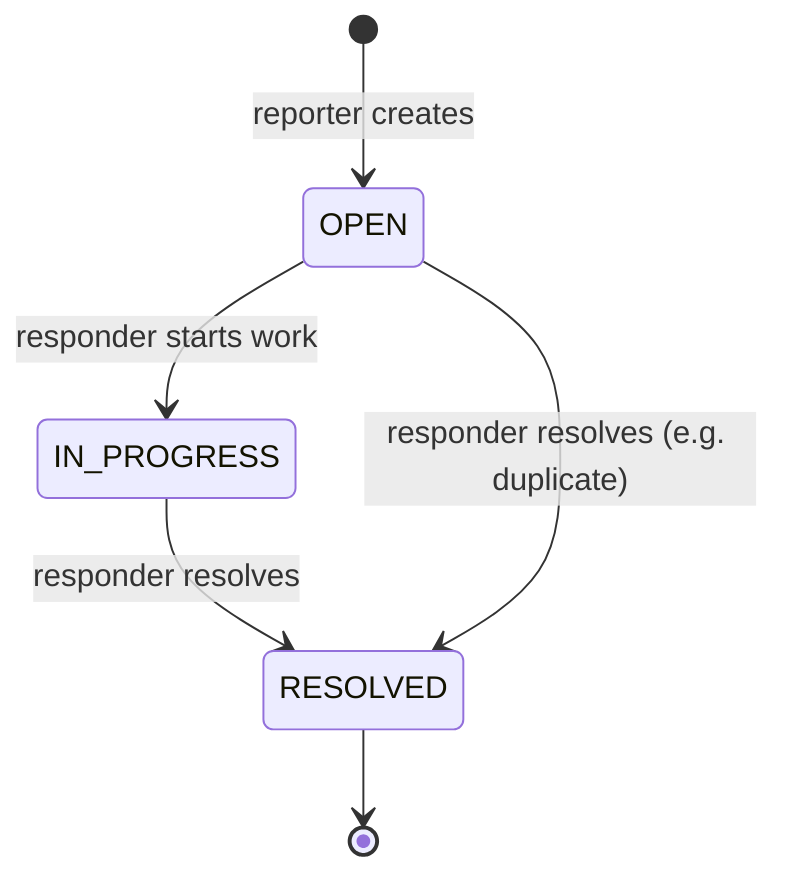
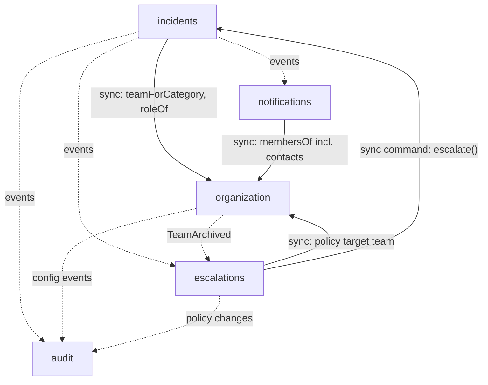

# Incident Management System — Domain Model

## 1. Purpose
Responders create, escalate, comment on, and resolve incidents while an audit trail is preserved. Each incident is owned by one team at a time.
The system is built as a **modular monolith** (see [ADR-0001](adr/architecture/0001-use-a-modular-monolith.md)); every module is designed so it could later be extracted into a microservice.
Full per-module responsibilities, data entities, relationships, data flow, assignment/priority and escalation design: [system-design.md](system-design.md).
Architecture diagrams (C4 context, containers, components): [c4-model.md](c4-model.md).

## 2. Users and roles
Both roles are owned by the `organization` module: a **global system role** on `User` and a **per-team role** on `Membership`, so one person can hold different roles in different teams.

| Role | Scope | Owner | What they do                                                                                              |
|---|---|---|-----------------------------------------------------------------------------------------------------------|
| `USER` | global | organization (`User.systemRole`) | Any user. **Reports** incidents by choosing a **category**, reads all incidents, comments on incidents they reported. |
| `ADMIN` | global | organization (`User.systemRole`) | Manages teams, categories and escalation policies (*seeded by Flyway; no admin UI*), reassigns any open incident, replays dead letters. |
| `RESPONDER` | per team | organization (`Membership.teamRole`) | Notified about incidents the team owns; changes status, severity and priority, escalates, comments and resolves. |
| `TEAM_LEAD` | per team | organization (`Membership.teamRole`) | Same rights as a responder in v1; reserved for stricter rules later (e.g. resolving SEV1). |

The full permission table is in [ADR-0013](adr/security/0013-authenticate-users-and-authorize-incident-access-by-team.md).

"Reporter" is therefore an **action** any user performs, not a stored type. A user with no memberships can only report.

Example: Alice is `USER`; she is `TEAM_LEAD` in *DBA Team* and `RESPONDER` in *Network Ops*. Bob is `USER` with no memberships, so he can only report.

**Category** is the routing key: reporters choose something they understand ("Payments", "Database", "VPN") without knowing the org structure, and `organization` maps each category to the responsible team. Re-organising teams means remapping categories only.

## 3. Core use case (thin slice)

## 4. Modules (bounded contexts)
| Module | Owns | Key entities / value objects |
|---|---|---|
| `organization` | Users (global role, contacts), teams, membership with per-team role, category → team routing | `User` (id, name, email, `SystemRole` = USER / ADMIN), `Team`, `Membership(teamId, userId, TeamRole)` with `TeamRole` = RESPONDER / TEAM_LEAD, `Category(id, name, teamId)` |
| `incidents` | Incident lifecycle, severity, priority, owning team, escalation, comments | `Incident` (aggregate root), `IncidentId`, `IncidentStatus`, `Severity`, `Priority` (proposed), `Comment` |
| `escalations` | Escalation policies and automatic escalation decisions | `EscalationPolicy(teamId, severityThreshold, targetTeamId)`, `EscalationDecision` |
| `notifications` | Notification intent and delivery attempts (delivery stubbed) | `Notification(recipientId, channel, status, attempts)`, `NotificationStatus` |
| `audit` | Immutable record of significant actions | `AuditEntry(eventId, actorId, action, entityType, entityId, occurredAt, payload, correlationId, correctsEntryId)` |

### Incident aggregate
- `Severity`: `SEV1` (critical) … `SEV4` (low): impact, drives automatic escalation.
- `Priority` (proposed): `P1` … `P4`, defaults from severity: urgency, drives the team's queue order.
- `IncidentStatus` lifecycle:

- Invariants enforced inside the aggregate:
  - only allowed transitions (above);
  - any user may create an incident;
  - only a member (RESPONDER or TEAM_LEAD) of the **current** owning team may change status, severity or priority, escalate or resolve (checked via `organization` API `roleOf(teamId, userId)`);
  - team members and the reporter may comment;
  - `team_id` and `priority` change only inside `incidents`; raising priority or changing the team is an escalation;
  - a `RESOLVED` incident cannot be modified.

### Escalation
An incident is owned by **one team, never an individual**, and has a **priority** (`P1..P4`, defaulting from severity).
Escalation means **reassigning the incident to another team and/or raising its priority**
([ADR-0011](adr/incidents/0011-assign-incidents-to-teams-and-escalate-by-reassignment-or-priority.md)):
- *manual:* a member of the owning team escalates, giving a reason;
- *automatic:* when severity reaches the team policy's threshold, `escalations` records an `EscalationDecision` and asks `incidents` to reassign the incident to the target team and raise its priority.

`incidents` applies the change and publishes `IncidentEscalated`. `notifications` then notifies the (new) owning team. Status does not change.

## 5. Module dependencies

Solid arrows = synchronous call to the target module's public `api` package (a query, or a command to the data owner). Dotted = asynchronous event (outbox).

Rules:
- No module accesses another module's repository, entity, or database schema.
- No cross-schema foreign keys; modules reference each other only by ID.
- The dependency graph is acyclic; `organization` and `audit` depend on no other module's API (they only consume or publish events).
- Boundaries are enforced by a Spring Modulith `ApplicationModules.verify()` test (to be added, see [system-design.md](system-design.md) §10).

### Published events (schema owned by the publisher)
| Event | Owner | Consumers |
|---|---|---|
| `IncidentCreated` | incidents | notifications, audit, escalations |
| `IncidentStatusChanged` | incidents | notifications, audit, escalations |
| `IncidentSeverityChanged` | incidents | escalations, audit |
| `IncidentPriorityChanged` (proposed) | incidents | audit |
| `IncidentEscalated` (moves to incidents, proposed) | incidents | notifications, audit, escalations |
| `CommentAdded` | incidents | audit |
| `TeamArchived` and other configuration events (proposed) | organization, escalations | audit; `TeamArchived` also escalations |

Every event carries `eventId`, `occurredAt`, `actorId`, `correlationId`, `schemaVersion`, and incident events also `aggregateId` and `aggregateVersion` (proposed). Delivery is at-least-once and ordered per incident; schemas evolve additively ([ADR-0014](adr/architecture/0014-evolve-event-schemas-additively-with-a-schema-version.md)).

## 6. Answers to the required design questions
**Which actions belong in the same transaction?**
Only an incident state change and its outbox event. Notifications, audit writes and escalation evaluation happen after commit, driven by the outbox ([ADR-0008](adr/messaging/0008-publish-domain-events-through-a-transactional-outbox.md)).

**Which information belongs to the incident versus the responder team?**
The incident holds its **current** `teamId`, `categoryId` (plus a category-name snapshot), status, severity, priority, escalation level and comments. Team name, members, contacts and routing rules stay in `organization`. The incident never copies member lists; earlier owning teams are in the audit timeline.

**What must be immutable in the audit record?**
All fields of an `AuditEntry`: `eventId`, `actorId`, `action`, `entityType`, `entityId`, `occurredAt`, `payload`, `correlationId`, `correctsEntryId`. The table is append-only (the app role has no UPDATE/DELETE privileges, no update methods in code); corrections are new entries ([ADR-0010](adr/audit/0010-make-the-audit-log-append-only.md)).

**Where will RabbitMQ eventually fit, and what problem will it solve?**
Between the outbox relay and the consumer modules, starting with `notifications` only ([ADR-0012](adr/messaging/0012-deliver-incident-events-to-notifications-through-rabbitmq.md)). It decouples consumers so they can be scaled or extracted independently, gives durable per-consumer queues, retries via TTL queues and a dead-letter exchange.

**What event would be published later, and who owns its schema?**
`IncidentCreated` first (it drives notifications); its schema is owned by `incidents` and versioned via `schemaVersion` ([ADR-0014](adr/architecture/0014-evolve-event-schemas-additively-with-a-schema-version.md)).

## 7. Future AI boundary (not implemented yet)
An *Incident investigation assistant* will be a separate module/service consuming incidents, timeline (audit) and runbooks through read-only APIs / MCP tools. It will never write to other modules' data directly.

## 8. Open questions
1. Can a `RESOLVED` incident be reopened, or is `RESOLVED` terminal in v1?
2. ~~Should escalation reassign the incident to the target team, or only notify it additionally?~~ Answered by ADR-0011: it reassigns.
3. Which actions should be restricted to `TEAM_LEAD` later (e.g. resolving SEV1, lowering severity)? In v1 none (ADR-0013).
4. ~~Who may change severity — only team members, or the reporter too?~~ Answered by ADR-0013: only members of the owning team; the reporter may comment.
5. Do we need confidential incidents with restricted read access?
6. Which real notification channels come first (email, Slack, SMS)?
