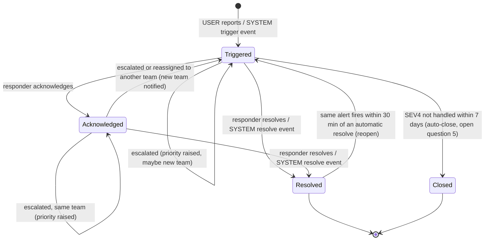
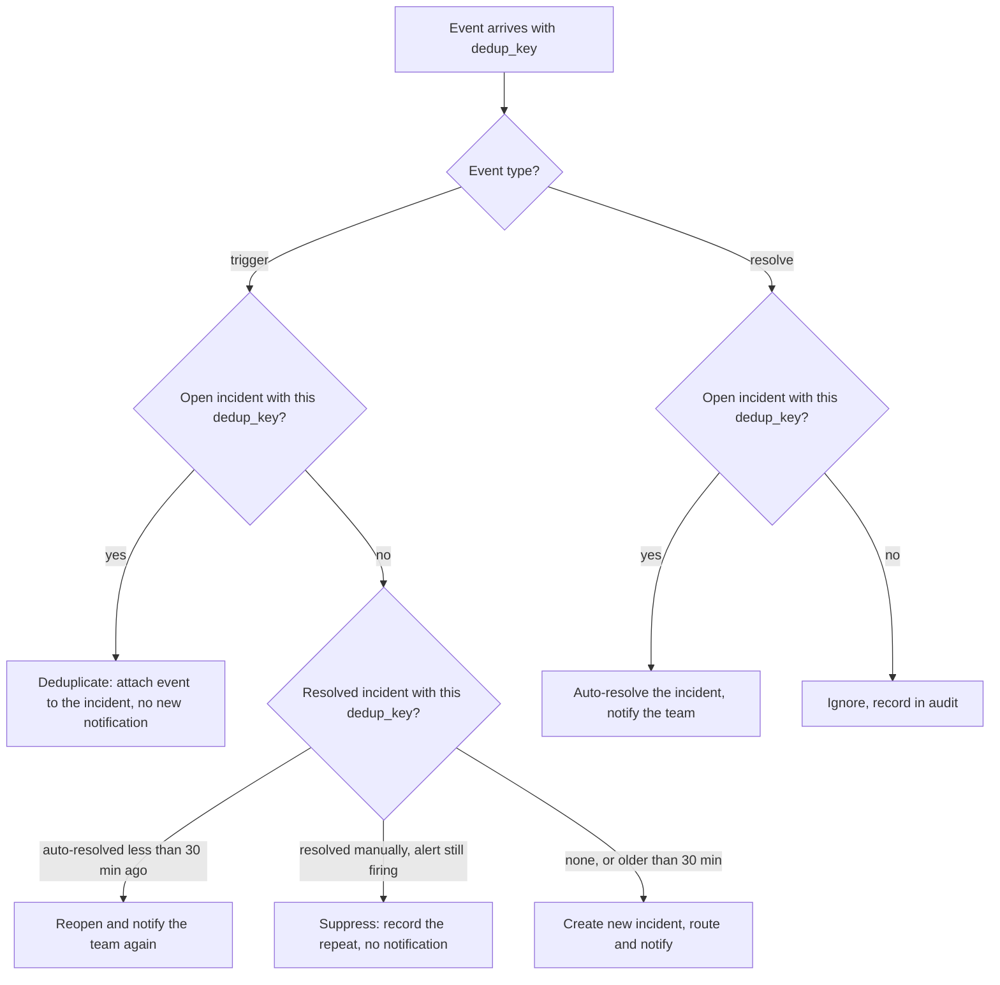
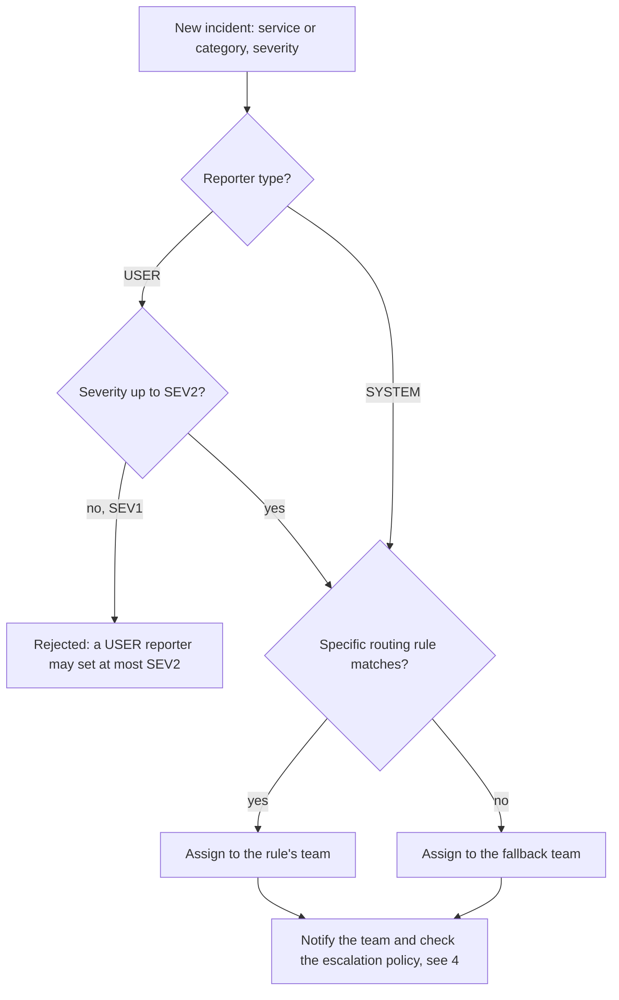
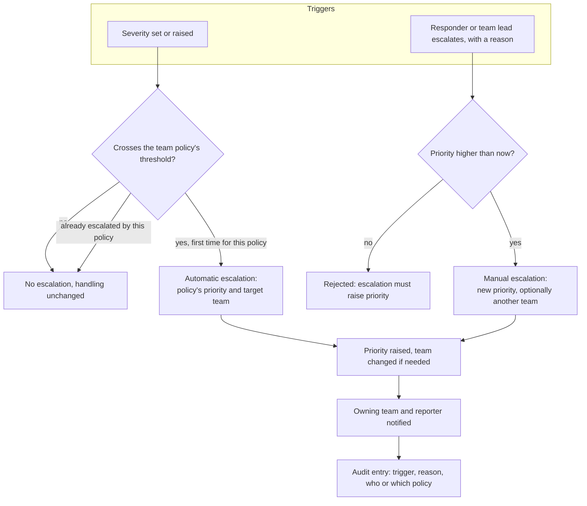
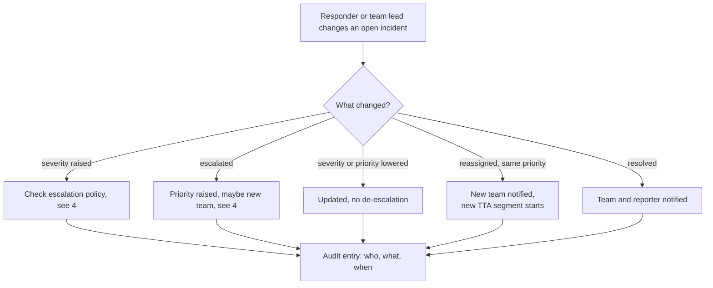

# Incident Management System — Behavior Diagrams

How the functionality behaves, derived from [productDesign.md](productDesign.md) §8 (user stories), §9 (metrics) and §11 (open questions).
User-facing flows are in [sequenceDiagrams.md](sequenceDiagrams.md). Points marked *(assumption)* are not stated in the product design and need confirming.

## 1. Incident lifecycle

An incident is triggered by a person (USER reporter) or a monitoring system (SYSTEM reporter), acknowledged by a responder, and resolved by a responder or by the alert clearing.

- Escalation never changes the state by itself; only a hand-over to another team puts the incident back to Triggered for the new team.
- TTA is measured from Triggered to Acknowledged; each reopen or reassignment starts a new segment.
- TTR is measured from the first trigger to the final resolve, including reopened periods.

## 2. Handling a monitoring event (SYSTEM reporter)

Events carry a `dedup_key`, so repeats of the same alert update one incident instead of creating many (stories 1–4).

- *(assumption)* Suppression after a manual resolve lasts until the monitoring system sends a resolve event for that `dedup_key`.
- Dedup ratio = events / incidents; reopen rate = reopened / system-resolved incidents, per service.

## 3. Routing a new incident

Target: more than 90% of incidents routed by a specific rule, not by the fallback team.

## 4. Escalation

Escalation means the incident needs **different handling**: it always **raises priority**, and may also hand the incident over to another team.
It is triggered by a decision or a severity change, **never by time** — an unacknowledged incident does not escalate by itself.

- Moving an incident to another team **without** raising priority is a plain reassignment, not an escalation.
- Lowering severity or priority afterwards does not de-escalate.
- *(assumption)* Notification is a single email per change; there are no repeated pages or ack timeouts.

## 5. Changes on an open incident

- Every significant action, human or automatic, gets an audit entry (target 100%), so an auditor sees the full timeline including the reporter (story 10).

## 6. Conflicts with productDesign.md

These parts of the product design assume time-based escalation and need rewording:

| Where | Current text | Conflict |
|---|---|---|
| Story 6 | acknowledge a SEV1 *so that escalation stops* | Escalation is not running in the background, so acknowledging does not stop it |
| Story 9 | duty manager paged *when nobody acknowledged a SEV1 after all repeats* | Time-based; no repeats or final fallback |
| §9 metrics | *% acknowledged at level 1*, *% escalation exhausted* | No escalation levels to measure |
| §11 Q2, Q6 | default ack timeout per severity; final fallback target | Not needed for escalation |
