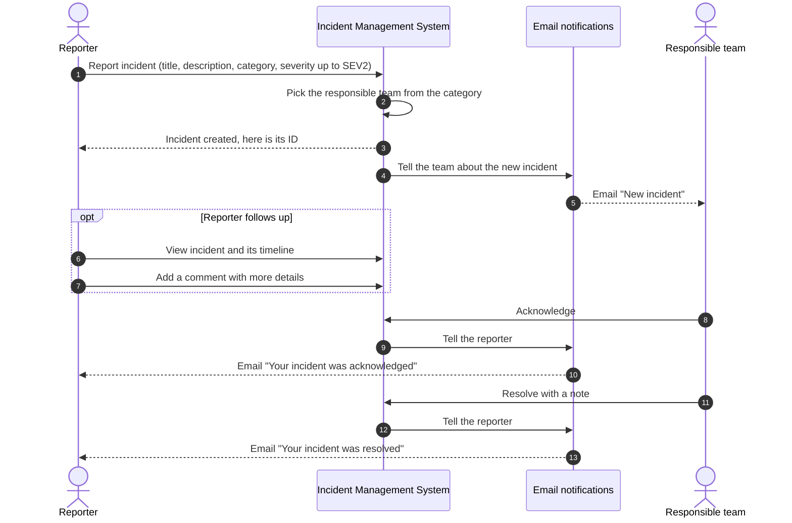
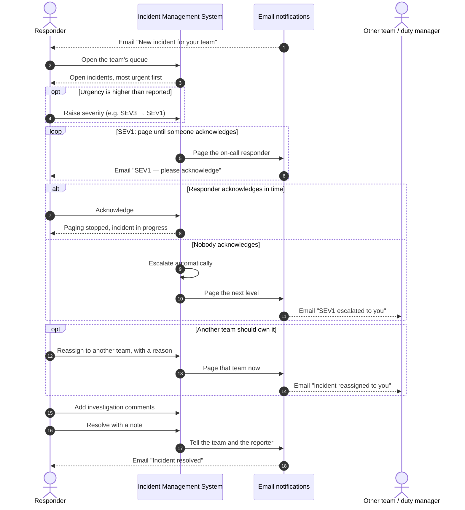

# Incident Management System — Sequence Diagrams

What a user can do with the system, derived from the user stories in [productDesign.md](productDesign.md) §8.
Like a C4 context view, the system is one box; internal modules are not shown. **Email notifications** covers everything that informs people, including sending the email over SMTP.

## 1. User as reporter

Story 5: *As an employee (USER reporter), I create an incident for a service with a severity up to SEV2, so that the right team is engaged — and I'm told when it's acknowledged and resolved.*

## 2. User as responder

Stories 6, 7 and 8: *paged for a SEV1 and acknowledge it, so that escalation stops*; *reassign to another team, whose on-call is paged immediately*; *raise a SEV3 to SEV1 and the policy starts paging*.

