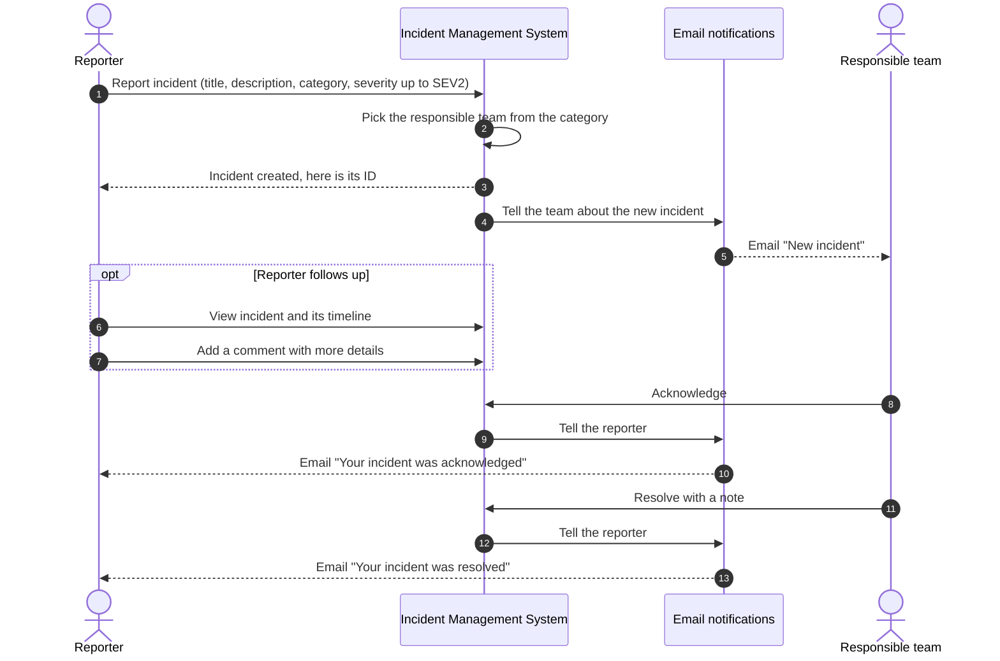
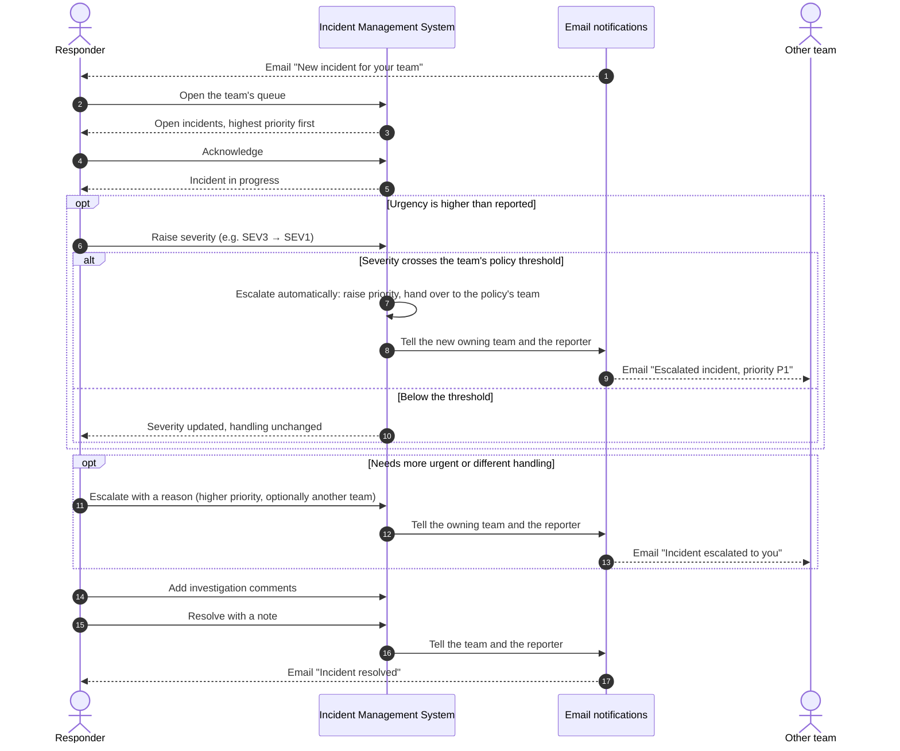

# Incident Management System — Sequence Diagrams

What a user can do with the system, derived from the user stories in [productDesign.md](productDesign.md) §8.
Like a C4 context view, the system is one box; internal modules are not shown. **Email notifications** covers everything that informs people, including sending the email over SMTP.

## 1. User as reporter

Story 5: *As an employee (USER reporter), I create an incident for a service with a severity up to SEV2, so that the right team is engaged — and I'm told when it's acknowledged and resolved.*

## 2. User as responder

Stories 7 and 8: *reassign to another team, whose on-call is notified immediately*; *raise a SEV3 to SEV1 and the policy escalates, so that urgency matches reality*.
Escalation always **raises priority** (and may move the incident to another team); it is triggered by a person or by a severity change, never by time.

