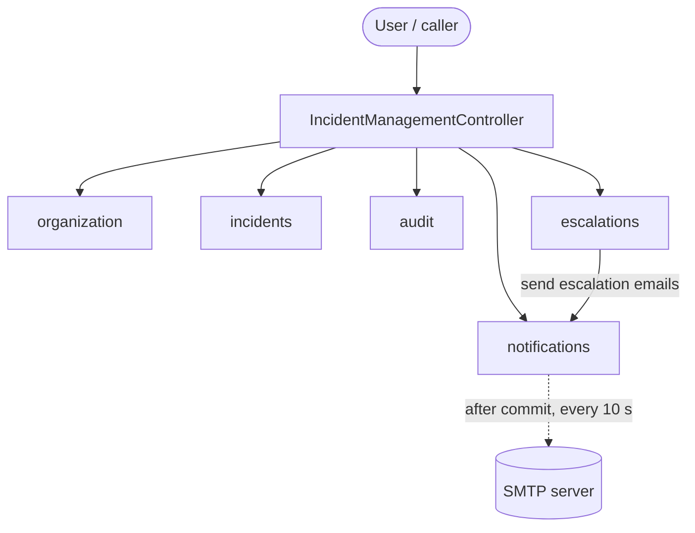
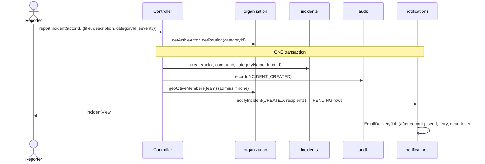
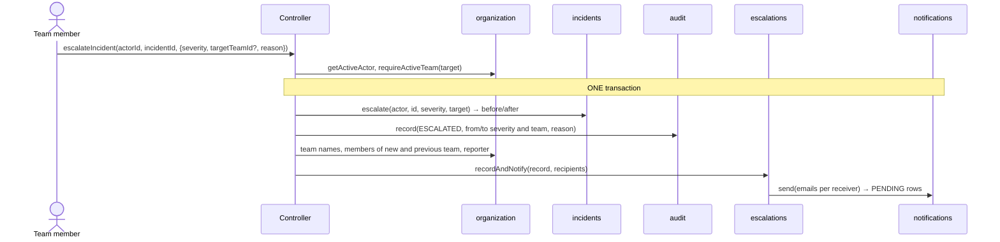
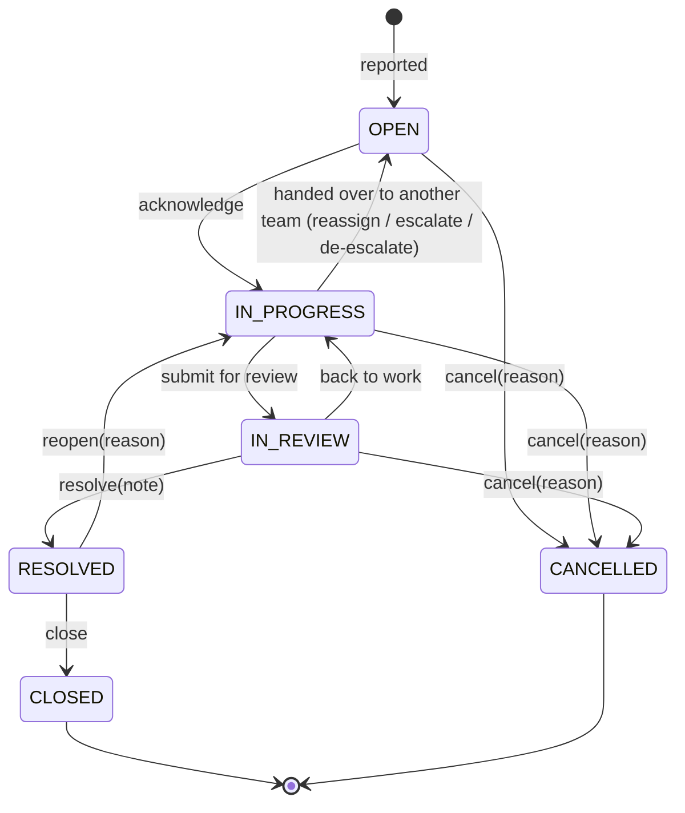

# Incident Management System — System Design

**Updated:** 2026-10-02
**Scope:** modules, responsibilities, data, flows and rules of the implemented system.
**Related:** [product design](product%20design/productDesign.md) (what and why), [c4-model.md](c4-model.md) (diagrams),
[development-plan.md](development-plan.md) (build steps and progress).

The product design says *what* and *why*; this document describes *how the code does it*. Decisions taken while
building (HTTP only as a thin test API, severity only, manual escalation only) are recorded in the development plan.

---

## 1. Goal and module map
Users **report, acknowledge, comment on, escalate, reassign and resolve** incidents. Each incident is owned by **one
team** at a time, the right people are **emailed**, and every significant action leaves an **append-only audit entry**.

The system is **one Spring Boot application** (monolith). Users call Java methods on a single
entry point, `IncidentManagementController`, which orchestrates five modules. `IncidentManagementHttpController` exposes
each of these methods as an HTTP endpoint for testing (the caller is the `X-User-Id` header, no login); it contains
no logic. Each module has `model/`, `repository/`
and `service/` (`XxxService` interface + `XxxServiceImpl`) and its own PostgreSQL schema.

| Module | Responsible for | Schema | Service |
|---|---|---|---|
| `organization` | Users, teams with per-team roles, categories → team routing | `organization` | `OrganizationService` |
| `incidents` | Incident lifecycle, severity, owning team, comments, permission checks | `incidents` | `IncidentService` |
| `audit` | Append-only record of every significant action; timelines | `audit` | `AuditService` |
| `notifications` | One email per recipient, templates, SMTP delivery with retries and dead letters | `notifications` | `NotificationService` |
| `escalations` | Escalation history and escalation emails (per receiver) | `escalations` | `EscalationService` |

**Rules:**
- Modules never call each other — the Controller does. **One exception:** `escalations` uses `NotificationService`
  to send the escalation emails it writes.
- A module uses only its own packages and `common` (exceptions; `Actor`, `Recipient`, `Severity`, `SystemRole`, `TeamRole`).
- Cross-module references are plain `UUID`s; there are no foreign keys between schemas.
- Services return records (views), never JPA entities.

---

## 2. Responsibilities

### Controller (`IncidentManagementController`)
- **Does:** for every user action, checks the actor (`organization.getActiveActor`), calls the services in order,
  and runs it all in **one transaction**; picks recipients (team members, falling back to admins; the reporter unless
  they are the actor); creates a correlation id per action for the audit trail; admin-only checks.
- **Does not:** contain business rules about incidents (those are in `incidents`), write SQL or send emails.

### organization
- **Does:** who may act (`getActiveActor`: active, not SYSTEM, with team ids); active categories and their team;
  teams with active members; recipients (members, admins, a single user); checks a team is active.
- **Enforces:** unique email (stored lower-case) and names; a team keeps ≥ 1 member; archived teams can't change.
- **Does not:** know about incidents. Users, teams and categories are seeded (no admin functions yet).

### incidents
- **Does:** create, read, team queue, my reported incidents; acknowledge, resolve, change severity, escalate,
  reassign, comment.
- **Enforces:** the lifecycle; who may do what (§5); a reporter may set at most SEV2; an escalation must raise
  severity; a resolved incident is read-only; concurrent changes (`@Version`) → "changed concurrently, retry".
- **Does not:** email anyone or write audit entries (the Controller does).

### audit
- **Does:** appends entries (actor, action, entity, incident, details, correlation id, time); incident timeline;
  a user's activity.
- **Enforces:** append-only — no update/delete methods, `@Immutable` entity, and a database trigger that rejects
  `UPDATE`/`DELETE`.

### notifications
- **Does:** renders regular incident emails (created, acknowledged, resolved, reassigned); stores one `PENDING` row
  per recipient in the caller's transaction; `EmailDeliveryJob` sends due rows every 10 s over SMTP; replay of dead
  letters.
- **Retries:** after 1, 5 and 15 minutes (4 attempts), then `DEAD_LETTERED` with an ERROR log.
- **Does not:** decide who is notified (the Controller passes recipients).

### escalations
- **Does:** records each escalation (actor, reason, severity and team before/after) and writes one email per kind of
  receiver: owning team, previous team (if handed over), reporter. Everyone gets at most one email; the person who
  escalated gets none.
- **Does not:** change the incident (the Controller calls `incidents.escalate` first).

---

## 3. Data per module
All ids are UUIDs, times `timestamptz` (UTC). Flyway owns the schemas (`db/migration/<module>/V<n>xx__*.sql`);
Hibernate only validates.

| Schema | Tables | Notes |
|---|---|---|
| `organization` | `app_user`, `team`, `team_membership(team_id, user_id, role)`, `category` | SYSTEM user created by `V101`; demo data by the `seed` profile (`db/seed/R__seed_organization.sql`) |
| `incidents` | `incident`, `comment` | `incident` keeps a category-name snapshot, `team_id`, `reporter_id`, `severity`, `status`, timestamps, `resolved_by`, `resolution_note`, `version` |
| `audit` | `audit_entry` | `details` is jsonb (ids and values, no personal data); trigger `audit_entry_append_only` |
| `notifications` | `notification` | recipient email copied at creation; `status`, `attempts`, `next_attempt_at`, `last_error`; partial index on due rows |
| `escalations` | `escalation` | `from/to_severity`, `from/to_team_id`, `reason`, `escalated_at` |

---

## 4. How data flows

### 4.1 Report an incident

### 4.2 Escalate

### 4.3 Other actions
| Action | Audit | Emails |
|---|---|---|
| acknowledge (`OPEN → IN_PROGRESS`) | `STATUS_CHANGED` | reporter |
| resolve (with note) | `STATUS_CHANGED` | owning team + reporter |
| change severity (up or down) | `SEVERITY_CHANGED` | none |
| reassign (another team, same severity; back to `OPEN`) | `REASSIGNED` + reason | new team + reporter |
| comment | `COMMENT_ADDED` | none |
| replay a dead letter (admin) | `NOTIFICATION_REPLAYED` | the replayed email |

Recipients never include the person acting, and nobody gets the same email twice.

---

## 5. Incident rules

**Severity** — impact: `SEV1` (critical) … `SEV4` (low). The only urgency measure: it orders the team queue
(most severe first, then oldest). A reporter may set at most `SEV2`.

**Lifecycle:**

Only `OPEN`, `IN_PROGRESS` and `IN_REVIEW` incidents can be commented on, edited (title, description), escalated or
reassigned; they form the team queue.

**Escalation** — a member of the owning team raises severity, with a reason, and may hand the incident over to
another active team. It is never time-based. **De-escalation** is the same with severity going down; both are
recorded by the escalations module and emailed. **Reassignment** moves it to another team without changing severity.

**Who may do what:**
| Function | Who |
|---|---|
| report, read incident, my incidents, team queue, timeline, notifications, escalations | any active user |
| comment | members of the owning team, the reporter |
| acknowledge, resolve, change severity, escalate | members of the **current** owning team |
| reassign | members of the owning team, `ADMIN` |
| dead letters, replay, user activity | `ADMIN` |

`TEAM_LEAD` has no extra rights yet. Errors: `UnauthenticatedException`, `ForbiddenException`, `NotFoundException`,
`BusinessRuleException`.

**Timestamps for metrics:** `created_at → acknowledged_at` (time to acknowledge), `created_at → resolved_at`
(time to resolve); per-team figures need the ownership periods from the audit timeline.

---

## 6. Users
| Data | Why |
|---|---|
| `id` | The only reference other modules keep (reporter, author, recipient, actor); never reused |
| `name`, `email` (unique, lower-case) | Shown in emails; email is the only channel |
| `system_role` | `USER`, `ADMIN` (reassign anything, dead letters, activity), `SYSTEM` (author of future automatic actions; cannot act) |
| memberships `team_id` + `role` | Who may change an incident; who is emailed |
| `active`, `deactivated_at` | Deactivated users keep their id in history but can't act and aren't emailed |

Personal data stays in `organization`; notifications copy the address only to send; audit details hold ids.
There is **no login** yet: callers pass the acting user id, and unknown, deactivated or SYSTEM users are rejected.

---

## 7. Failures and consistency
- **One transaction per action:** if any step fails (e.g. the audit insert), the incident change, the audit entry,
  the notification rows and the escalation record are all rolled back.
- **SMTP down:** actions still succeed; emails stay `RETRYING` and are sent later, or are dead-lettered after
  ~21 minutes and can be replayed by an admin.
- **Crash after commit:** pending emails are rows in the database and are sent after restart.
- **Two people change the same incident:** the second gets "changed concurrently, retry".
- **Several instances:** the email job locks rows with `FOR UPDATE SKIP LOCKED`, so an email is not sent twice at the same time.

---

## 8. Open questions
1. Automatic escalation by team policy (severity reaches a threshold → hand-over) — postponed; when?
2. Which actions become `TEAM_LEAD`-only: resolving SEV1, lowering severity, reassigning?
3. Is `RESOLVED` final, or can an incident be reopened?
4. Confidential incidents with restricted read access (e.g. security incidents)?
5. UI on top of the HTTP API, and login (OIDC) instead of the `X-User-Id` header?
