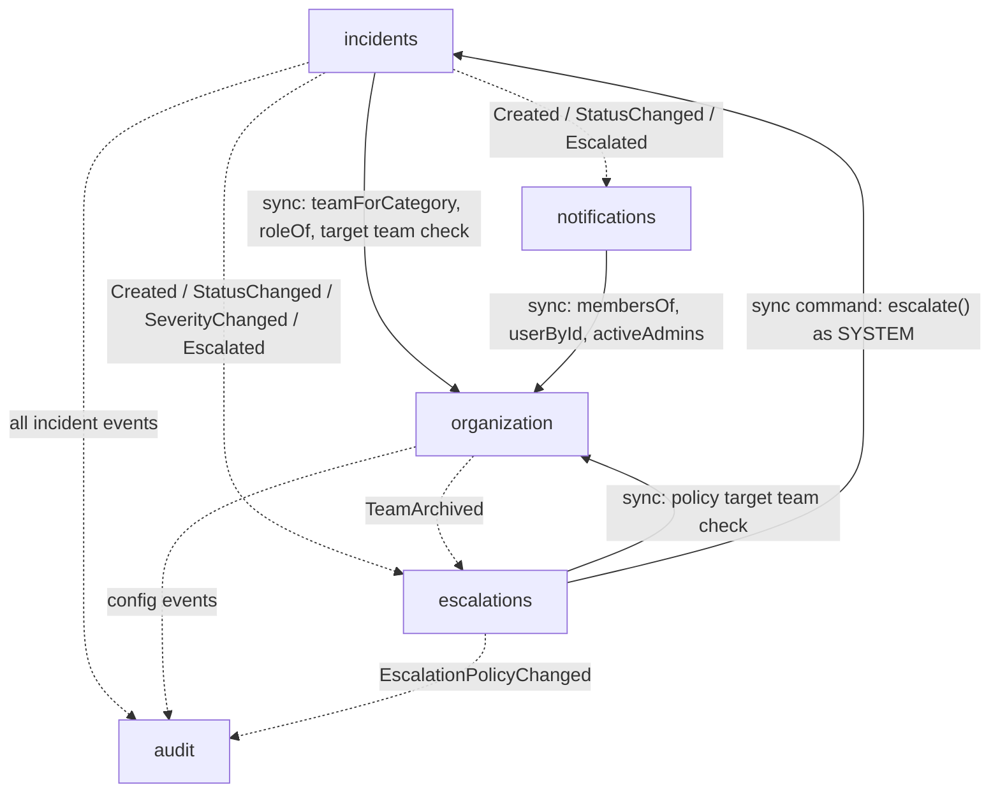
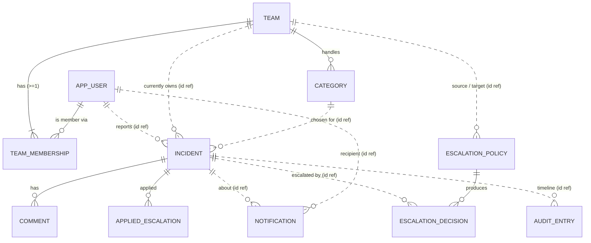
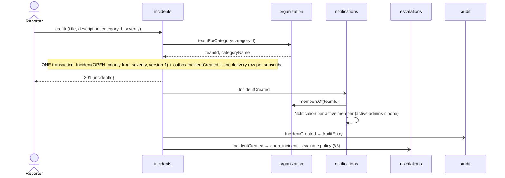
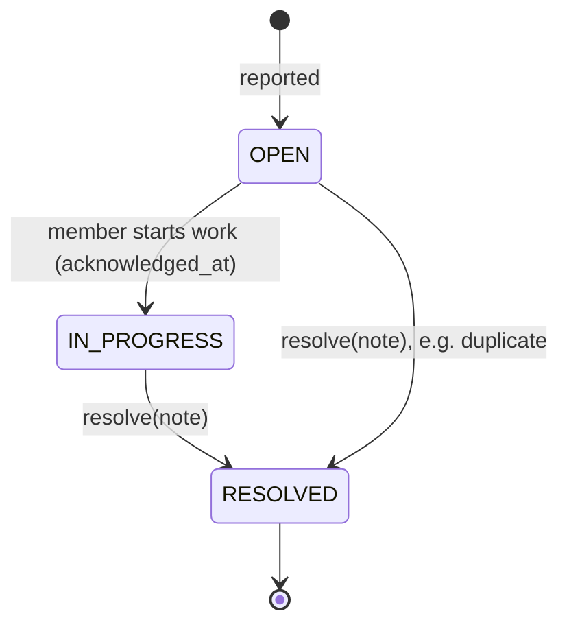
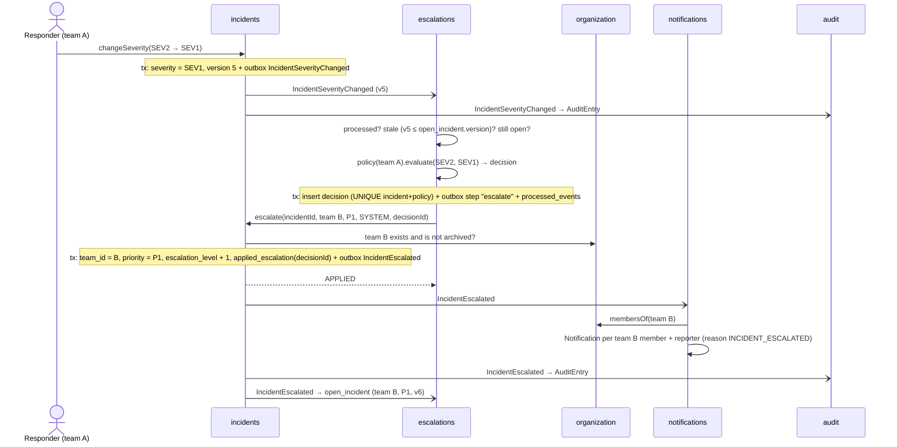

# Incident Management System — System Design

**Updated:** 2026-09-29
**Scope:** responsibilities, data, relationships and data flow of the five modules.
**Related:** [domain-model.md](domain-model.md) (overview), [adr/](adr/README.md) (decisions), [c4-model.md](c4-model.md) (C4 diagrams).

This document applies the decisions in ADR-0001 … ADR-0016 (ADR-0012 is rejected). Where it and an ADR disagree, the ADR wins, and this document should be fixed.

Fields and methods marked **(proposed)** do not exist in code yet; everything else matches the current code
(`*.api`, `*.domain`, `organization.user`, `organization.team`, `V1__organization_schema.sql`).
Section 10 lists the proposed changes as a checklist.

---

## 1. Goal and module map
Responders **create, escalate, comment on and resolve** incidents. Each incident is owned by **one team** at a time, and every significant action leaves an **immutable audit trail**.
The system is a modular monolith ([ADR-0001](adr/architecture/0001-use-a-modular-monolith.md)) with one PostgreSQL schema per module ([ADR-0003](adr/data/0003-give-each-module-its-own-database-schema.md)).

| Module | Responsible for | Owns (schema) | Exposes | Depends on |
|---|---|---|---|---|
| `organization` | Who people are, which teams exist, who is in which team with which role, which team handles which category | `organization` | `OrganizationApi` (sync), configuration events | nothing |
| `incidents` | The incident itself: lifecycle, severity, priority, owning team, comments, escalation (reassign / raise priority) | `incidents` | `IncidentApi` (sync), all incident events incl. `IncidentEscalated` | `organization` (sync) |
| `escalations` | Escalation policies and **automatic** escalation decisions | `escalations` | `EscalationApi` (sync), `EscalationPolicyChanged` | `organization` (sync + events), `incidents` (sync command + events) |
| `notifications` | Telling people: one notification per recipient, delivery, retry, dead letter, replay | `notifications` | `NotificationApi` (sync) | `organization` (sync), `incidents` events |
| `audit` | Append-only record of every significant action; timelines | `audit` | `AuditApi` (read-only) | events of all modules |

Solid = synchronous call to the target's `api` package. Dotted = asynchronous event via the publisher's outbox ([ADR-0008](adr/messaging/0008-publish-domain-events-through-a-transactional-outbox.md)).

**The graph is acyclic.** `incidents` never depends on `escalations`. `escalations` asks the owner of the data to change it through a synchronous **command**, `IncidentApi.escalate` ([ADR-0007](adr/architecture/0007-query-synchronously-publish-side-effects-asynchronously.md)), and `incidents` publishes the resulting `IncidentEscalated`. For the same reason, `organization` never asks `incidents` or `escalations` anything: it publishes `TeamArchived`, and `escalations` reacts ([ADR-0015](adr/data/0015-deactivate-or-archive-referenced-data-instead-of-deleting-it.md)).

---

## 2. Responsibilities

### organization
- **Does:**
  - users: identity, contacts, global role, active/deactivated, anonymization on erasure;
  - teams, archived instead of deleted;
  - memberships with a per-team role (`RESPONDER | TEAM_LEAD`);
  - categories → team routing;
  - configuration events, including `TeamArchived` (proposed).
- **Enforces** ([ADR-0015](adr/data/0015-deactivate-or-archive-referenced-data-instead-of-deleting-it.md)):
  - unique email;
  - unique team and category names;
  - **a team always has ≥ 1 active member**, so the last active member can't be deactivated;
  - at least one active `ADMIN`;
  - a team can't be archived while an active category routes to it;
  - deactivated users are never returned as members.
- **Does not:** know about incidents, severity or escalation.

### incidents
- **Does:**
  - report an incident (team resolved from the category);
  - change status, severity and priority;
  - **escalate** (proposed): reassign to another team and/or raise priority, manually or on behalf of `escalations` ([ADR-0011](adr/incidents/0011-assign-incidents-to-teams-and-escalate-by-reassignment-or-priority.md));
  - comment;
  - offer each team its queue (proposed);
  - write its own events to its outbox in the same transaction.
- **Enforces:**
  - the status lifecycle;
  - the authorization rules of [ADR-0013](adr/security/0013-authenticate-users-and-authorize-incident-access-by-team.md) (owning team changes, reporter comments, admin reassigns);
  - it is the **only writer** of `team_id` and `priority`;
  - a RESOLVED incident is read-only.
- **Does not:**
  - decide *whether* to escalate automatically (escalations does);
  - send messages (notifications does);
  - keep member lists or contacts (organization does).

### escalations
- **Does:**
  - store one policy per team (`severityThreshold`, `targetTeam`);
  - evaluate the policy on incident events, in version order, ignoring stale events;
  - record an `EscalationDecision` once per incident and policy;
  - ask `incidents` to apply it (`IncidentApi.escalate` as SYSTEM, from its outbox);
  - deactivate policies of archived teams when it receives `TeamArchived`.
- **Does not:**
  - write incident data or publish `IncidentEscalated` (incidents does);
  - notify anyone directly.

### notifications
- **Does:**
  - turn events into one `Notification` per recipient (idempotent on `sourceEventId + recipientId`);
  - fall back to the active admins when a team has no active members;
  - deliver each notification by **email over SMTP** from its own delivery worker ([ADR-0016](adr/messaging/0016-send-notifications-by-email-over-smtp-without-a-message-broker.md)); a `LOG` stub channel in `local`/`test`;
  - retry transient failures with backoff, dead-letter permanent failures at once ([ADR-0009](adr/messaging/0009-retry-failed-deliveries-and-dead-letter-them.md));
  - manual replay.
- **Does not:** decide who is responsible (asks `organization.membersOf`).

### audit
- **Does:**
  - record every consumed event as an immutable `AuditEntry` (idempotent on `eventId`);
  - answer timeline / by-actor / by-correlation queries.
- **Does not:**
  - update or delete entries (a correction is a new entry);
  - participate in business transactions.

### shared
Not a business module: a small kernel that every module may depend on. It owns no schema and no API.
- **Contains:**
  - `DomainEvent` and `EventMetadata`, the envelope every event carries (`eventId` for idempotency, `occurredAt`, `actorId`, `correlationId`, `schemaVersion`) ([ADR-0007](adr/architecture/0007-query-synchronously-publish-side-effects-asynchronously.md), [ADR-0014](adr/architecture/0014-evolve-event-schemas-additively-with-a-schema-version.md));
  - `DomainException` (→ HTTP 409/422) and `NotFoundException` (→ HTTP 404);
  - `Checks`, argument checks shared by domain classes.
- **Does not:**
  - hold business rules or module-specific types (ids and views live in each module's `api`);
  - depend on any module.

---

## 3. Data entities per module

Common conventions:
- ids are UUIDs;
- timestamps are `timestamptz` (UTC);
- mutable aggregates carry `version` (optimistic locking). The incident version is also the `aggregateVersion` of its events;
- rows referenced from other modules are **never deleted**; they are deactivated or archived instead ([ADR-0015](adr/data/0015-deactivate-or-archive-referenced-data-instead-of-deleting-it.md));
- Flyway migrates as `ims_migrator`, and the application connects as `ims_app`, which has no DDL rights ([ADR-0003](adr/data/0003-give-each-module-its-own-database-schema.md)).

### 3.1 organization (implemented: `V1__organization_schema.sql`)

**`app_user`**

| Field | Type | Req. | Rule |
|---|---|---|---|
| id | uuid | ✔ | PK |
| name | varchar(200) | ✔ | not blank; "Deleted user" after anonymization |
| email | varchar(320) | ✔ | lower-case, UNIQUE, `x@y`; `deleted+<id>@invalid` after anonymization |
| phone | varchar(32) | – | **(proposed)** for SMS/paging |
| preferred_channel | varchar(20) | – | **(proposed)** `EMAIL`, `SMS`, … |
| system_role | varchar(20) | ✔ | `USER`, `ADMIN` |
| active / deactivated_at | boolean / timestamptz | ✔ / – | `active = (deactivated_at IS NULL)` |
| created_at, updated_at, version | | ✔ | |

**`team`**

| Field | Type | Req. | Rule |
|---|---|---|---|
| id | uuid | ✔ | PK |
| name | varchar(200) | ✔ | not blank, UNIQUE (case-insensitive) |
| archived_at | timestamptz | – | archived teams receive no new incidents or escalations; their open incidents stay with them |
| created_at, updated_at, version | | ✔ | |

**`team_membership`**

| Field | Type | Req. | Rule |
|---|---|---|---|
| team_id | uuid | ✔ | FK → team, ON DELETE CASCADE |
| user_id | uuid | ✔ | FK → app_user, ON DELETE RESTRICT |
| role | varchar(20) | ✔ | `RESPONDER`, `TEAM_LEAD` |

- **PK** `(team_id, user_id)`.
- The ≥ 1 member invariant is enforced by the `Team` aggregate. The "≥ 1 **active** member" rule needs users too, so it is enforced in the `OrganizationApi` implementation (proposed).

**`category`**

| Field | Type | Req. | Rule |
|---|---|---|---|
| id | uuid | ✔ | PK |
| name | varchar(100) | ✔ | UNIQUE (case-insensitive) |
| team_id | uuid | ✔ | FK → team, ON DELETE RESTRICT |
| active | boolean | ✔ | inactive = not selectable by reporters |
| created_at, updated_at, version | | ✔ | |

### 3.2 incidents

**`incident`** (aggregate root)

| Group | Field | Type | Req. | Rule |
|---|---|---|---|---|
| What happened | id | uuid | ✔ | PK |
| | title | varchar(200) | ✔ | not blank |
| | description | text (≤ 5000) | – | |
| | attributes | jsonb | – | **(proposed)** affected service, environment, labels ([ADR-0002](adr/data/0002-use-postgresql-as-the-only-data-store.md)) |
| Who owns it | category_id, category_name | uuid, varchar(100) | ✔ | name is a snapshot at creation |
| | team_id | uuid | ✔ | **current** owning team: from the category at creation, changed only by escalation ([ADR-0011](adr/incidents/0011-assign-incidents-to-teams-and-escalate-by-reassignment-or-priority.md)) |
| | reporter_id | uuid | ✔ | any active user |
| How urgent | severity | `SEV1..SEV4` | ✔ | impact; drives automatic escalation |
| | priority | `P1..P4` | ✔ | **(proposed)** urgency and queue order; defaults from severity |
| Lifecycle | status | `OPEN, IN_PROGRESS, RESOLVED` | ✔ | see §7 |
| | created_at, updated_at | timestamptz | ✔ | |
| | acknowledged_at | timestamptz | – | **(proposed)** first move to `IN_PROGRESS` → MTTA |
| | resolved_at, resolved_by, resolution_note | | – | set together on resolve; `resolved_by` **(proposed)** → MTTR |
| Escalation | escalation_level | int | ✔ | **(proposed)** 0 = never escalated; +1 per applied escalation |
| | escalated_at | timestamptz | – | **(proposed)** time of the last escalation |
| | version | bigint | ✔ | **(proposed)** optimistic locking; `aggregateVersion` of events |

**`comment`**

| Field | Type | Req. | Rule |
|---|---|---|---|
| id | uuid | ✔ | PK |
| incident_id | uuid | ✔ | FK → incident (same schema) |
| author_id | uuid | ✔ | member of the owning team, or the reporter ([ADR-0013](adr/security/0013-authenticate-users-and-authorize-incident-access-by-team.md)) |
| text | text (≤ 5000) | ✔ | not blank |
| created_at | timestamptz | ✔ | |

**`applied_escalation`** (proposed): makes `escalate` idempotent for automatic calls.

| Field | Rule |
|---|---|
| decision_id | PK, the `decisionId` from `escalations` |
| incident_id | |
| result | `APPLIED` or `NOT_APPLIED` (+ reason); a repeated call returns this |
| applied_at | |

**`outbox`** and **`outbox_delivery`** (proposed, [ADR-0008](adr/messaging/0008-publish-domain-events-through-a-transactional-outbox.md)): the same shape in every publishing module.

| Table | Field | Rule |
|---|---|---|
| `outbox` | event_id | PK |
| | type, schema_version, payload (jsonb), correlation_id, occurred_at | the event and the request that caused it |
| | aggregate_id, aggregate_version | order per incident |
| `outbox_delivery` | event_id, subscriber | PK; one row per subscriber (`audit`, `escalations`, `notifications`) |
| | status | `PENDING`, `RETRYING`, `SENT`, `DEAD_LETTERED` |
| | attempts, next_attempt_at, last_error | retry state ([ADR-0009](adr/messaging/0009-retry-failed-deliveries-and-dead-letter-them.md)) |

Rows whose deliveries are all `SENT` are purged after 7 days ([ADR-0015](adr/data/0015-deactivate-or-archive-referenced-data-instead-of-deleting-it.md)).

### 3.3 escalations

**`escalation_policy`**

| Field | Req. | Rule |
|---|---|---|
| id | ✔ | PK |
| team_id | ✔ | UNIQUE (one policy per team in v1) |
| severity_threshold | ✔ | escalate when severity crosses this level |
| target_team_id | ✔ | `≠ team_id`; must be an existing, non-archived team (checked via organization) |
| active | ✔ | **(proposed)** false after `TeamArchived` for either team |
| version | ✔ | |

**`escalation_decision`** (immutable)

| Field | Req. | Rule |
|---|---|---|
| id | ✔ | PK, **(proposed)** deterministic: derived from `(incident_id, policy_id)`; sent as `decisionId` |
| incident_id, policy_id | ✔ | **UNIQUE(incident_id, policy_id)** (proposed); one decision per policy per incident |
| source_team_id, target_team_id | ✔ | |
| severity | ✔ | severity that triggered it |
| trigger | ✔ | **(proposed)** `SEVERITY_THRESHOLD` (future: `NOT_ACKNOWLEDGED`) |
| triggered_by | ✔ | **(proposed)** actor of the event that caused it |
| source_event_id, decided_at | ✔ | |

**`open_incident`** (proposed read model)
- Columns: `incident_id` PK, `team_id`, `severity`, `priority`, `status`, `version`.
- Kept up to date from incident events. An event whose `aggregateVersion` ≤ `version` is stale and ignored ([ADR-0007](adr/architecture/0007-query-synchronously-publish-side-effects-asynchronously.md)).
- Lets escalations skip resolved incidents without calling `incidents`.

**`outbox`, `outbox_delivery`** (for the `escalate` command step and `EscalationPolicyChanged`) and **`processed_events(event_id PK, processed_at)`**, purged after 30 days.

### 3.4 notifications

**`notification`**

| Field | Req. | Rule |
|---|---|---|
| id | ✔ | PK |
| source_event_id, recipient_id | ✔ | **UNIQUE(source_event_id, recipient_id)**: the idempotency key |
| incident_id | ✔ | |
| channel | ✔ | `EMAIL`; `LOG` in `local`/`test` ([ADR-0016](adr/messaging/0016-send-notifications-by-email-over-smtp-without-a-message-broker.md)) |
| reason | ✔ | `INCIDENT_CREATED`, `INCIDENT_STATUS_CHANGED`, `INCIDENT_ESCALATED` |
| message | ✔ | |
| status | ✔ | `PENDING → SENT`, or `PENDING → RETRYING → … → SENT \| DEAD_LETTERED` |
| attempts, next_attempt_at, last_error, created_at, sent_at | | delivery state |

### 3.5 audit

**`audit_entry`** (append-only: `ims_app` has only `INSERT` and `SELECT`, [ADR-0010](adr/audit/0010-make-the-audit-log-append-only.md))

| Field | Req. | Rule |
|---|---|---|
| id | ✔ | PK |
| event_id | ✔ | UNIQUE, so a redelivered event is recorded once |
| actor_id | ✔ | user, or the **SYSTEM** actor for automatic actions |
| action | ✔ | event type, e.g. `IncidentEscalated`; `CORRECTION` for corrections |
| entity_type, entity_id | ✔ | `INCIDENT`, `ESCALATION`, `NOTIFICATION`; **(proposed)** `USER`, `TEAM`, `CATEGORY`, `ESCALATION_POLICY` |
| incident_id | – | **(proposed)** set for everything about an incident, so the timeline includes escalations and notifications |
| occurred_at | ✔ | |
| payload | ✔ | jsonb snapshot of the event with its `schemaVersion` (ids, no contact data) |
| correlation_id | ✔ | the request chain |
| corrects_entry_id | – | set only on correction entries |

---

## 4. Relationships

Solid lines are real foreign keys **inside** one schema. Dotted lines are plain id references **across** schemas: there is
no FK ([ADR-0003](adr/data/0003-give-each-module-its-own-database-schema.md)), and consistency is kept by the application.

| From → To | Cardinality | How |
|---|---|---|
| team → membership ← user | team 1..*, user 0..* | FK, PK `(team_id, user_id)` |
| team → category | 1 → 0..* | FK `category.team_id` |
| category → incident | 1 → 0..* | id + name snapshot |
| team → incident (owner) | 1 → 0..* | id; set from the category, changed only by escalation. Earlier owners are in the audit timeline |
| user → incident (reporter) | 1 → 0..* | id |
| incident → comment | 1 → 0..* | FK in `incidents` |
| team → escalation_policy | 1 → 0..1 (v1) | id, UNIQUE `team_id` |
| incident → escalation_decision | 1 → 0..1 per policy | id, UNIQUE `(incident_id, policy_id)` |
| escalation_decision → applied_escalation | 1 → 0..1 | `decision_id` |
| incident → notification | 1 → 0..* (one per event × recipient) | id |
| anything → audit_entry | 1 → 0..* | `entity_type + entity_id`, plus `incident_id` |

**Why id-only references are safe** ([ADR-0015](adr/data/0015-deactivate-or-archive-referenced-data-instead-of-deleting-it.md)):
- referenced rows are never deleted: users are deactivated or anonymized (the id stays), teams are archived, categories and policies are deactivated;
- ids are UUIDs, never reused;
- the id is validated through the owning module's API at write time (e.g. `teamForCategory`, `roleOf`, the target-team check).

---

## 5. How data flows

### 5.1 Report an incident

### 5.2 Plan the team's queue (proposed)
1. The team opens its queue with `IncidentApi.queueFor(teamId)`: all non-resolved incidents it currently owns, ordered by **priority, severity, created_at**.
2. The team decides internally who works on what. There is no individual assignee ([ADR-0011](adr/incidents/0011-assign-incidents-to-teams-and-escalate-by-reassignment-or-priority.md)).
3. To make an incident **more** urgent, a member **escalates** it with a higher priority (§5.4). Lowering priority is an ordinary change, `changePriority`, which publishes `IncidentPriorityChanged`.
4. `audit` records every change.

### 5.3 Work and resolve
1. `startProgress` publishes `IncidentStatusChanged(OPEN→IN_PROGRESS)` and sets `acknowledged_at`.
2. `addComment`, by a team member or the reporter, publishes `CommentAdded`.
3. `resolve(note)` publishes `IncidentStatusChanged(→RESOLVED)`. As a result:
   - notifications informs the team and the reporter;
   - audit records the change;
   - escalations removes the incident from `open_incident`.

### 5.4 Manual escalation (proposed)
1. A member of the owning team (or an `ADMIN`, for a reassignment) calls `escalate(incidentId, targetTeamId?, priority?, reason)`.
2. `incidents` checks the actor, and the target team through `organization` (exists, not archived). In one transaction it:
   - changes `team_id` and/or raises `priority`;
   - increments `escalation_level` and sets `escalated_at`;
   - writes `IncidentEscalated` (trigger `MANUAL`) to the outbox.
3. If nothing would change, e.g. same team and no higher priority, or the incident is `RESOLVED`, the call fails with 409.
4. `notifications` notifies the new owning team and, on a reassignment, the reporter. `audit` records the escalation with the human actor and the reason. `escalations` updates `open_incident`.

The automatic path is described in §8.

### 5.5 Events

Every event carries `EventMetadata(eventId, occurredAt, actorId, correlationId, schemaVersion)`, plus **`aggregateId` and `aggregateVersion` (proposed)** for incident events ([ADR-0007](adr/architecture/0007-query-synchronously-publish-side-effects-asynchronously.md)).

| Event | Publisher | Payload (besides metadata) | Consumers |
|---|---|---|---|
| `IncidentCreated` | incidents | incidentId, teamId, categoryId, severity, title, priority (proposed) | notifications, audit, escalations |
| `IncidentStatusChanged` | incidents | incidentId, teamId, from, to | notifications, audit, escalations |
| `IncidentSeverityChanged` | incidents | incidentId, teamId, from, to | escalations, audit |
| `IncidentPriorityChanged` **(proposed)** | incidents | incidentId, teamId, from, to (lowering only) | audit |
| `IncidentEscalated` **(moves to incidents, proposed)** | incidents | incidentId, from/to team, from/to priority, trigger (`MANUAL`, `SEVERITY_THRESHOLD`), reason, decisionId (automatic only), triggeredBy | notifications, audit, escalations |
| `CommentAdded` | incidents | incidentId, teamId, commentId | audit |
| `TeamArchived` **(proposed)** | organization | teamId | escalations, audit |
| `MemberAdded / MemberRemoved / MemberRoleChanged`, `CategoryRerouted`, `UserDeactivated` **(proposed)** | organization | ids + old/new values | audit |
| `EscalationPolicyChanged` **(proposed)** | escalations | policyId, old/new threshold and target, active | audit |

Delivery rules:
- **At-least-once.** Each consumer is idempotent by a unique key in its own schema: `processed_events` in escalations, `UNIQUE(source_event_id, recipient_id)` in notifications, `UNIQUE(event_id)` in audit.
- **Ordered per incident and subscriber** by the relay, and stale versions are ignored by `escalations` ([ADR-0008](adr/messaging/0008-publish-domain-events-through-a-transactional-outbox.md)).
- **Schemas evolve additively**, and a breaking change bumps `schemaVersion` with a transition period ([ADR-0014](adr/architecture/0014-evolve-event-schemas-additively-with-a-schema-version.md)).
- **Transport:** in-process, through the outbox relay. There is no message broker ([ADR-0016](adr/messaging/0016-send-notifications-by-email-over-smtp-without-a-message-broker.md)).

### 5.6 Failures
- **One subscriber fails:** only its delivery row retries (10 s … 15 min), then dead-letters. The other subscribers are unaffected ([ADR-0008](adr/messaging/0008-publish-domain-events-through-a-transactional-outbox.md), [ADR-0009](adr/messaging/0009-retry-failed-deliveries-and-dead-letter-them.md)).
- **The SMTP server fails for one recipient:** only that `Notification` retries. Connection errors and `4xx` replies are transient; a `5xx` reply for the recipient (e.g. `550` unknown mailbox) dead-letters at once.
- **The SMTP server is down:** incident creation is unaffected; notifications stay `RETRYING` and are sent when it is back, or dead-letter after ~21 minutes.
- **Dead letters:**
  - SEV1/SEV2 notifications page the platform on-call;
  - audit dead letters raise an alert;
  - all dead letters can be replayed (`NotificationApi.replay`, admin endpoint for outbox deliveries).

---

## 6. What we keep about users

| Data | Why it is critical |
|---|---|
| `id` | Every other module references users only by this id (reporter, comment author, notification recipient, audit actor). It survives deactivation and anonymization |
| `name` | Shown in the incident, queue and timeline |
| `email` (unique, lower-case) | Contact for notifications; maps the identity provider's token to a user ([ADR-0013](adr/security/0013-authenticate-users-and-authorize-incident-access-by-team.md)) |
| `system_role` | `ADMIN` manages teams, categories and policies, can reassign any open incident and replay dead letters; everyone else is `USER` |
| memberships: `team_id` + `role` | Authorization: may this user change this incident? Who gets notified? `TEAM_LEAD` has no extra rights in v1 |
| `active`, `deactivated_at` | People leave, but their id stays in incidents and audit. Deactivated users can't log in or act, and aren't notified |
| `created_at`, `updated_at`, `version` | Traceability and safe concurrent edits |
| `phone`, `preferred_channel` **(proposed)** | Needed as soon as there is a channel other than email |

**Personal data rules:**
- only `organization` stores contact data;
- other modules store only `userId` and fetch contacts at delivery time (`membersOf`, `userById`);
- audit payloads contain ids, not emails;
- erasure anonymizes the user and keeps the id ([ADR-0015](adr/data/0015-deactivate-or-archive-referenced-data-instead-of-deleting-it.md)).

**Authentication** ([ADR-0013](adr/security/0013-authenticate-users-and-authorize-incident-access-by-team.md)): the `X-User-Id` header works only in the `local` and `test` profiles. Other profiles require OIDC.

**SYSTEM actor (proposed):** one seeded, non-loginable user with a well-known id (e.g. `00000000-0000-0000-0000-000000000001`). It is the `actorId` for automatic actions such as policy-driven escalations.

---

## 7. What we keep about an incident

**To describe it fully:** `title`, `description`, `category` (+ name snapshot), `attributes` (affected service, environment, labels), `reporter`, `created_at`, and the comments.

**To route it to the right team** ([ADR-0006](adr/incidents/0006-route-incidents-to-teams-by-category.md), [ADR-0011](adr/incidents/0011-assign-incidents-to-teams-and-escalate-by-reassignment-or-priority.md)):
- `team_id` comes from the category at creation. Re-routing a category affects only new incidents.
- The incident belongs to **one team at a time** and never to an individual. The team decides internally who works on it.
- `team_id` changes only by **escalation** (reassignment). The new team becomes the only owner, and earlier owners are visible in the audit timeline.

**To set the right priority:**

| Severity (impact) | Default priority |
|---|---|
| SEV1 — critical, outage | P1 |
| SEV2 — major degradation | P2 |
| SEV3 — minor | P3 |
| SEV4 — low / cosmetic | P4 |

- **Severity** is set by the reporter and corrected by the team. It describes impact and **drives automatic escalation**.
- **Priority (proposed)** defaults from severity and **drives queue order**.
  - Raising it is an escalation, e.g. a SEV3 that blocks a release becomes P2.
  - Lowering it is an ordinary change.
- Raising severity does not change priority by itself. If the team's policy fires, the escalation raises priority to at least the severity's default.

**Lifecycle:**

Escalation is **not** a status. It changes the owning team and/or priority, so an incident can be `OPEN` and escalated, or `IN_PROGRESS` and escalated.

**Rules** (full table in [ADR-0013](adr/security/0013-authenticate-users-and-authorize-incident-access-by-team.md)):
- any active user may report and read incidents;
- only members of the **current** owning team may change status, severity or priority, escalate, or resolve;
- members of the owning team and the reporter may comment;
- an `ADMIN` may reassign any open incident;
- a RESOLVED incident is read-only;
- every change and its outbox event commit in one transaction.

**Timestamps for metrics:**
- `created_at → acknowledged_at` = time to acknowledge (MTTA);
- `created_at → resolved_at` = time to resolve (MTTR);
- per-team MTTA/MTTR must use the ownership periods from the audit timeline, because `team_id` can change.

---

## 8. Escalations

### What the module includes
- **`EscalationPolicy`** (per team): `severityThreshold`, `targetTeamId` (different from the team itself), `active`. Changed only by `ADMIN`.
- **`EscalationDecision`** (immutable): the fact that policy P decided to escalate incident X to team T at severity S, with the trigger and who caused it.
- **Read model `open_incident`**, **`processed_events`**, **`outbox`**.
- **`EscalationApi`**: `policyFor(teamId)`, `escalationsFor(incidentId)`.

### When an incident escalates automatically (v1)
The policy that is evaluated is the one of the team that **owns the incident when the event happened** (`teamId` in the event).
`EscalationPolicy.evaluate(previous, current)` escalates **only when severity crosses the threshold**:
- on creation at or above the threshold (`previous == null`);
- when severity is raised across the threshold (e.g. SEV2 → SEV1 with threshold SEV1).

It does **not** escalate:
- when severity stays above the threshold, or is lowered;
- when severity is raised again after lowering, because `UNIQUE(incident_id, policy_id)` allows one decision per policy;
- for a **stale** event (`aggregateVersion` ≤ `open_incident.version`), so events arriving out of order can't cause a wrong escalation.

**Chains and loops.** After a reassignment to B, B's policy can fire on a later severity rise (A → B → C). A loop A → B → A stops at the second hop, because A's policy has already fired for this incident.

**Future triggers:** not acknowledged within N minutes for its severity (a scheduler in escalations), and multi-level policies.

### How it is handled

Key properties:
- **No distributed transaction.** The decision commits in `escalations`. The incident change and `IncidentEscalated` commit together in `incidents`, driven by the escalations outbox step, which is retried and dead-lettered like any other delivery ([ADR-0009](adr/messaging/0009-retry-failed-deliveries-and-dead-letter-them.md)).
- **Idempotent everywhere:**
  - `processed_events` on the consumer side;
  - `UNIQUE(incident_id, policy_id)` on decisions, with a deterministic decision id;
  - `applied_escalation(decision_id)` in incidents: a repeated call returns the first result.
- **Races return `NOT_APPLIED`, not an error.** For an automatic call, the step ends as `SENT`, not `DEAD_LETTERED`, when:
  - the incident was resolved in the meantime;
  - it is already owned by the target team with at least the priority;
  - the target team was archived (WARN log and `escalations_not_applied_total{reason}`).

  The decision remains as a fact; `IncidentEscalated` is only published when something changed.
- **Concurrent changes** (e.g. a manual escalation at the same moment) are caught by optimistic locking. The automatic step retries and then sees the new state.

### Impact on the incident
- **Status does not change.** OPEN stays OPEN, IN_PROGRESS stays IN_PROGRESS.
- **Ownership moves** to the target team, which becomes the only team allowed to change the incident. The previous team keeps read access like everyone else.
- **Priority** is raised to at least the severity's default (automatic) or to the requested value (manual).
- `escalation_level` + 1 and `escalated_at` are set.
- Lowering severity afterwards does not de-escalate. Moving the incident back is another reassignment.

---

## 9. How escalations are audited

| What | Audit entry |
|---|---|
| The trigger | `IncidentSeverityChanged` (or `IncidentCreated`), actor = the responder / reporter |
| The escalation | `IncidentEscalated`: `entity_type = INCIDENT`, `entity_id = incidentId`; payload has from/to team, from/to priority, trigger, reason, `decisionId` |
| A decision that was not applied | No audit entry (nothing changed). It is visible through `EscalationApi.escalationsFor(incidentId)` and the `escalations_not_applied_total` metric |
| The notifications sent | Visible through `NotificationApi.notificationsFor(incidentId)`; dead letters are logged, counted and alerted |
| Policy changes | `EscalationPolicyChanged` **(proposed)**, actor = the admin |

**Fields in the escalation entry:**
- `actor_id`:
  - for **automatic** escalations, the **SYSTEM** actor; the human whose severity change caused it is in the payload as `triggeredBy`;
  - for **manual** escalations, the human, with the `reason`.
- `correlation_id`: copied from the triggering event. As a result, `AuditApi.byCorrelationId` returns the whole chain for one request: severity change → escalation → notifications.
- `payload`: ids only, no contact data, stored with its `schemaVersion`.
- `incident_id` **(proposed)**: equal to `entity_id` here. It matters for entries about other entities (e.g. notifications), so that `AuditApi.timeline(INCIDENT, incidentId)` shows everything.

**Guarantees** ([ADR-0010](adr/audit/0010-make-the-audit-log-append-only.md)):
- one entry per `event_id`;
- no UPDATE or DELETE: DB grants for `ims_app`, and no repository methods;
- mistakes are fixed with a correction entry (`AuditEntry.correctionOf`) that references the original;
- a missing entry shows up as an alerted `audit` dead letter and is replayed.

---

## 10. Follow-up changes
Changes the code needs to match this design and the ADRs. None are implemented yet.

**incidents**
- [ ] Add `priority`, `escalationLevel`, `escalatedAt`, `acknowledgedAt`, `resolvedBy` and `version` to `Incident`.
- [ ] Add `escalate(...)` (manual: 409 when nothing changes; automatic: `APPLIED` / `NOT_APPLIED`, idempotent by `decisionId` via `applied_escalation`) and `changePriority` (lowering only) to `Incident` and `IncidentApi`.
- [ ] Add `IncidentApi.queueFor(teamId)`, sorted by priority, severity, created_at.
- [ ] Move `IncidentEscalated` from `escalations.api.events` to `incidents.api.events`, and add `IncidentPriorityChanged`.
- [ ] Authorization per [ADR-0013](adr/security/0013-authenticate-users-and-authorize-incident-access-by-team.md): current owning team for changes, the reporter may comment, `ADMIN` may reassign.
- [ ] Add persistence: JPA entities, Flyway `db/migration/incidents`, `outbox` + `outbox_delivery` and a relay that keeps per-incident order.

**shared**
- [ ] Add `aggregateId` and `aggregateVersion` to incident events (`EventMetadata` or the event records).
- [ ] Event deserialization ignores unknown fields; add JSON examples per event version ([ADR-0014](adr/architecture/0014-evolve-event-schemas-additively-with-a-schema-version.md)).

**escalations**
- [ ] `EscalationPolicy.evaluate` creates a random decision id. Make it deterministic from `(incidentId, policyId)` and add `UNIQUE(incident_id, policy_id)`.
- [ ] Add `trigger` and `triggeredBy` to `EscalationDecision`, and fix its Javadoc ("the incident stays with its original team" is no longer true).
- [ ] Add the `open_incident` read model with `version`, and ignore stale events.
- [ ] Add the outbox step that calls `IncidentApi.escalate` as SYSTEM; update the `EscalationApi` Javadoc, which still refers to `escalations.api.events.IncidentEscalated`.
- [ ] Consume `TeamArchived` and deactivate the affected policies; add `active` to `EscalationPolicy`.
- [ ] Validate the policy's target team via organization (exists, not archived).

**notifications**
- [ ] Notify the reporter on reassignment and on resolve.
- [ ] Fall back to active admins when a team has no active members; add `notifications_no_recipients_total`.
- [ ] Add ±20 % jitter to `RetryPolicy` delays ([ADR-0009](adr/messaging/0009-retry-failed-deliveries-and-dead-letter-them.md)).
- [ ] Add a `permanent` flag to `DeliveryFailedException`; dead-letter permanent failures at once; add metric labels (`severity`, `channel`).
- [ ] Email delivery ([ADR-0016](adr/messaging/0016-send-notifications-by-email-over-smtp-without-a-message-broker.md)):
  - add `spring-boot-starter-mail`, `spring.mail.*` and `notifications.mail.from` config (secrets from env), 10 s timeouts;
  - `EmailChannel` (`JavaMailSender`, plain text, notification id in `Message-ID`) with SMTP error classification; `LogChannel` for `local`/`test`;
  - delivery worker: poll due notifications (`FOR UPDATE SKIP LOCKED`, batch 50), resolve the address via `userById`, `markSent` / `markFailed`;
  - render the subject (`[SEV] title`) and body into the notification when it is created, so the worker never calls `incidents`. `IncidentCreated` carries title and severity; `IncidentStatusChanged` and `IncidentEscalated` don't yet, so add them to those events (additive, [ADR-0014](adr/architecture/0014-evolve-event-schemas-additively-with-a-schema-version.md)) or read them via `IncidentApi.findById`;
  - GreenMail/Mailpit in integration tests and in `docker-compose`.

**audit**
- [ ] Add `incident_id` to `AuditEntry` and make `timeline(INCIDENT, id)` query by it.
- [ ] Extend `AuditEntityType` with `USER`, `TEAM`, `CATEGORY` and `ESCALATION_POLICY`.

**organization**
- [ ] Seed the SYSTEM actor.
- [ ] Add configuration events (membership, category routing, user deactivation, `TeamArchived`) so admin actions are audited.
- [ ] Implement `OrganizationApi` with the checks that span several tables ([ADR-0015](adr/data/0015-deactivate-or-archive-referenced-data-instead-of-deleting-it.md)):
  - the last active member of a team can't be deactivated;
  - at least one active admin remains;
  - a team can't be archived while an active category routes to it;
  - `membersOf` skips inactive users;
  - add `activeAdmins()` for the notification fallback;
  - anonymize a user on erasure.

**platform**
- [ ] Add `spring-modulith-starter-test` and `archunit-junit5` (test scope) so the boundary checks of ADR-0001/0003/0007 exist.
- [ ] Create the DB roles `ims_migrator` and `ims_app`; grant `ims_app` only `INSERT`/`SELECT` on `audit.audit_entry`.
- [ ] Register the `X-User-Id` filter only in the `local` and `test` profiles; fail startup without OIDC otherwise.
- [ ] Add the purge job for `outbox` (7 days) and `processed_events` (30 days).
- [ ] Alert rules: SEV1/SEV2 notification dead letters page the platform on-call; audit dead letters raise a ticket.

---

## 11. Open questions
1. Which actions become `TEAM_LEAD`-only later: resolving SEV1, lowering severity, reassigning? (v1: none, [ADR-0013](adr/security/0013-authenticate-users-and-authorize-incident-access-by-team.md).)
2. Is `RESOLVED` terminal, or can an incident be reopened (which would also re-arm escalation)?
3. When do time-based escalations (no acknowledgement within N minutes) and SLA timers arrive?
4. Do we need confidential incidents with restricted read access (e.g. security incidents)?
5. ~~Which real notification channels come first?~~ Email over SMTP ([ADR-0016](adr/messaging/0016-send-notifications-by-email-over-smtp-without-a-message-broker.md)). Slack/SMS remain open.
